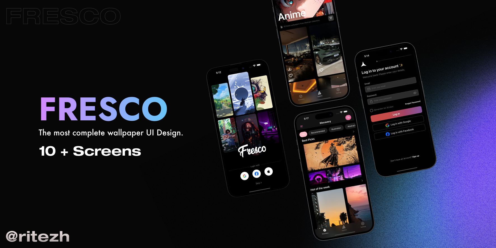
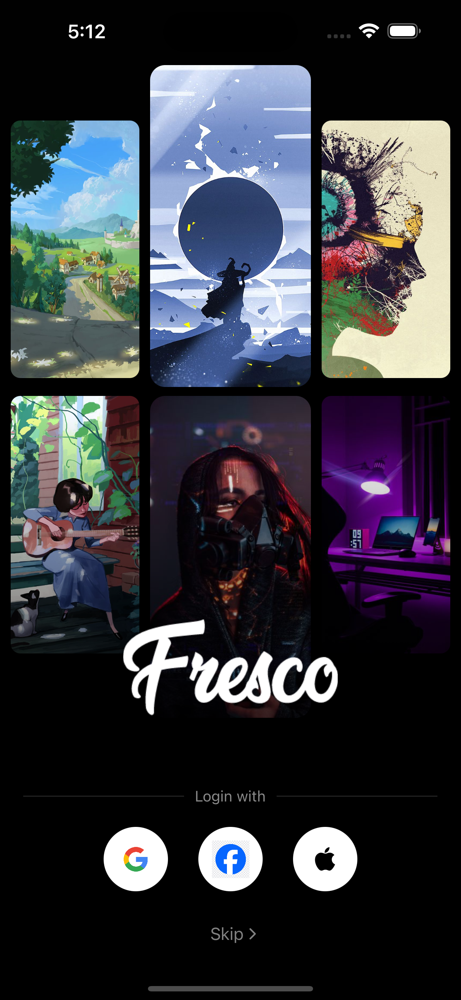
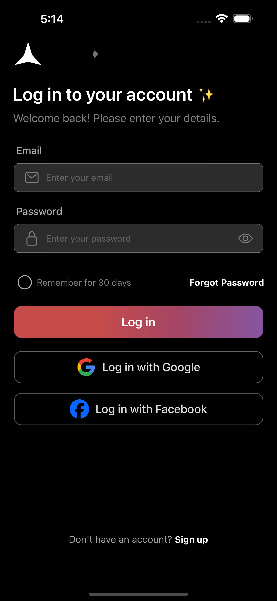
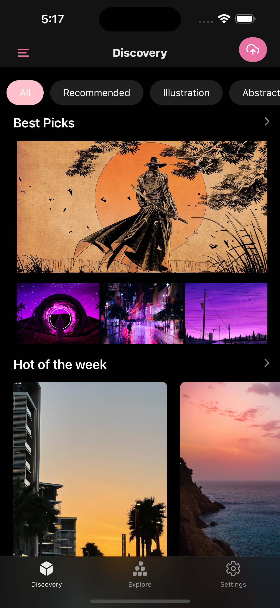
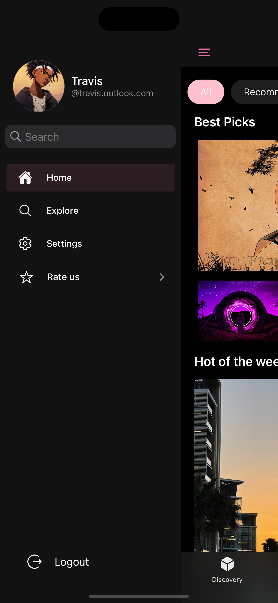
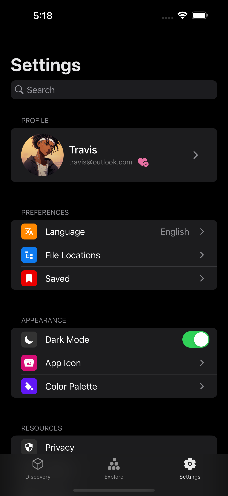
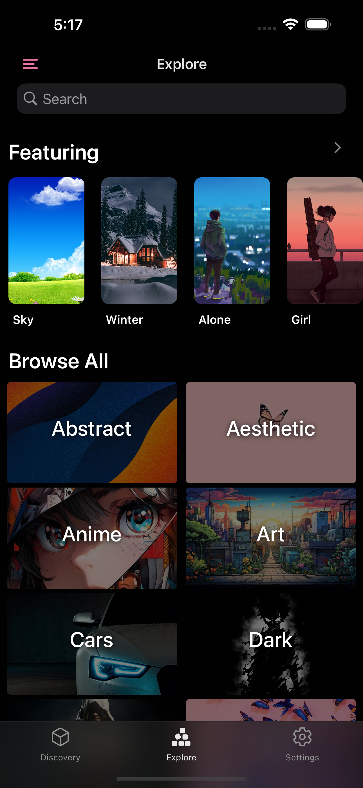
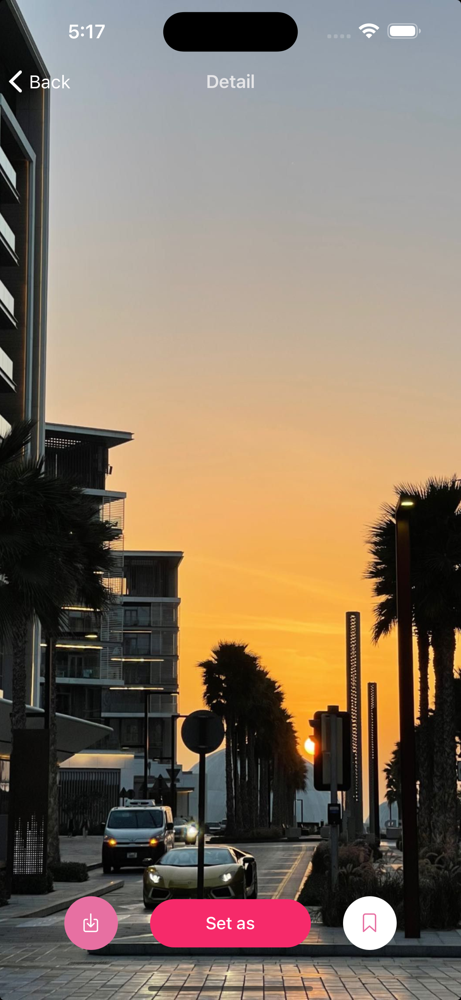
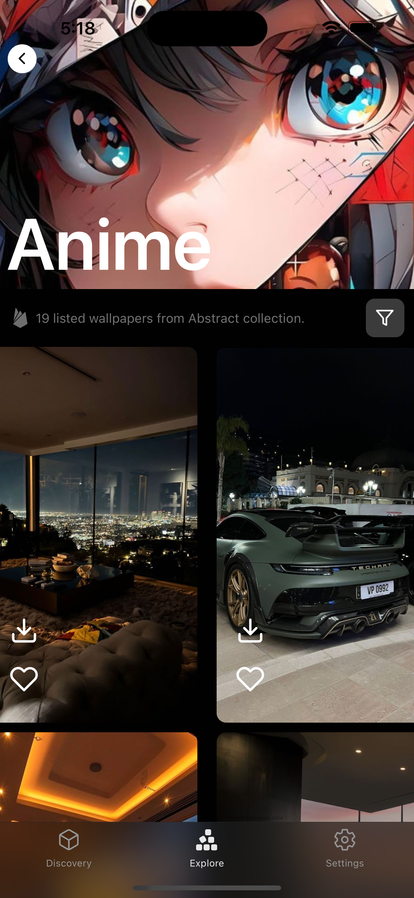
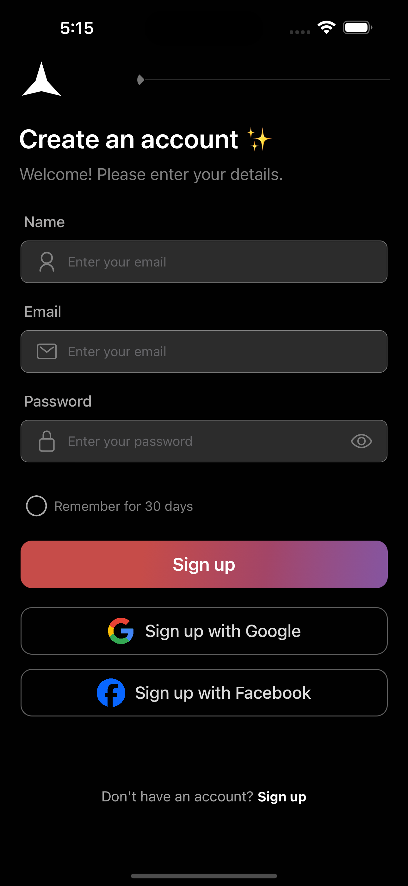

    

    

  

  
  
  
  

  
  

# Fresco

**Fresco** is an open-source wallpaper app UI designed to provide a sleek, modern, and user-friendly experience. Perfect for art lovers and design enthusiasts, Fresco combines intuitive design with powerful features, making it easy to explore and enjoy stunning wallpapers.

## Features 🚀

- **Clean and Modern Interface**: Enjoy a visually appealing dark-themed design that's easy on the eyes.

- **Responsive Design**: Optimized for all type of mobile screens, ensuring a consistent experience.
- **Smooth Animations**: Enjoy fluid and interactive animations that enhance usability.

- **High-Resolution Wallpapers**: Access a vast collection of high-quality wallpapers that look stunning on any screen.

- **Categories and Tags**: Easily browse wallpapers by categories and tags, making it simple to find the perfect image.

- **Search Functionality**: Quickly find specific wallpapers using a powerful search tool.

- **Favorites and Collections**: Save your favorite wallpapers and organize them into custom collections.

- **Wallpaper Previews**: Preview how wallpapers will look on your device before applying them.

- **Download and Share**: Download wallpapers to your device and share them with friends directly from the app.

- **User Uploads**: Allow users to upload their own wallpapers to the app's collection.

- **Wallpapers of the Day**: Discover new and trending wallpapers with a daily feature.

- **Offline Access**: Save wallpapers for offline use, ensuring you always have access to your favorite images.

## Screenshots

|                                                                                              |                                                                                                       |                                                                                                   |
| :------------------------------------------------------------------------------------------: | :---------------------------------------------------------------------------------------------------: | :-----------------------------------------------------------------------------------------------: |
|  |          |  |
|      |             |          |
|     |  |         |

## Preview 🎬

<video src="https://private-user-images.githubusercontent.com/119659853/338487933-e9d10c3a-7a01-420c-9b5c-1866e7a7d205.mp4?jwt=eyJhbGciOiJIUzI1NiIsInR5cCI6IkpXVCJ9.eyJpc3MiOiJnaXRodWIuY29tIiwiYXVkIjoicmF3LmdpdGh1YnVzZXJjb250ZW50LmNvbSIsImtleSI6ImtleTUiLCJleHAiOjE3MTgwOTI2MjIsIm5iZiI6MTcxODA5MjMyMiwicGF0aCI6Ii8xMTk2NTk4NTMvMzM4NDg3OTMzLWU5ZDEwYzNhLTdhMDEtNDIwYy05YjVjLTE4NjZlN2E3ZDIwNS5tcDQ_WC1BbXotQWxnb3JpdGhtPUFXUzQtSE1BQy1TSEEyNTYmWC1BbXotQ3JlZGVudGlhbD1BS0lBVkNPRFlMU0E1M1BRSzRaQSUyRjIwMjQwNjExJTJGdXMtZWFzdC0xJTJGczMlMkZhd3M0X3JlcXVlc3QmWC1BbXotRGF0ZT0yMDI0MDYxMVQwNzUyMDJaJlgtQW16LUV4cGlyZXM9MzAwJlgtQW16LVNpZ25hdHVyZT01NzM2YThkYzVjMzdiM2NjZmIyNWJmZjY5OWQyNzYyYTZhMDhmNWQ0M2RjMTkzMWI0NjM5MTY3ZmIyOTE5NzFlJlgtQW16LVNpZ25lZEhlYWRlcnM9aG9zdCZhY3Rvcl9pZD0wJmtleV9pZD0wJnJlcG9faWQ9MCJ9.1x-GPqlUEEdr9wuZFu8WTvZesqj_VKQ-ue9-TpRBoLQ" title="Title"></video>

> [!CAUTION]  
> The UI is not compatible with expo go app. You have to prebuild your expo app.

## Installation 🛠

To install Fresco, follow these steps:

1. Clone the repository: `git clone https://github.com/rit3zh/Fresco`
2. Navigate to the project directory: `cd Fresco`
3. Install dependencies: `npm install`
4. Navigate to the ios directory: `cd ios` and install all the required pods `pod install`
5. Finally run the application: `npm run ios`

### ⭐ Consider leaving a Star if you like this repository. ⭐
